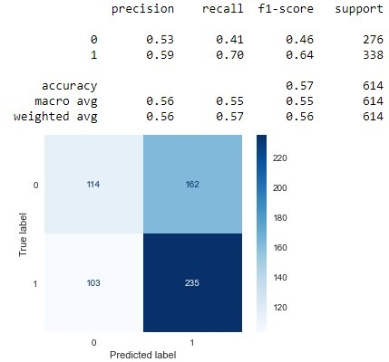
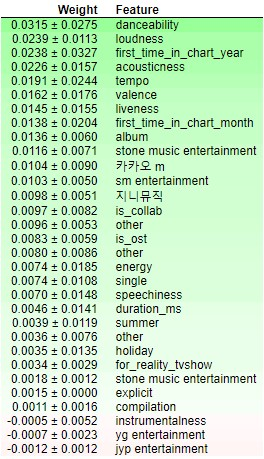

<div align="center"></div>

<h3 align="center">Predict if a K-Pop song will be a hit</h3>

<div align="center">
    
    
</div>

<h4 align="center">Trabajo de Fin de Master</h4>

### Descripción

El análisis de datos junto con la inteligencia artificial permiten resolver preguntas y problemas interesantes que se plantean. Hoy en día, existen canciones que son populares y otras muchas que son poco conocidas. Por ejemplo, la revista Billboard publica cada semana una lista con las canciones más escuchadas utilizando aspectos como la cantidad de ventas y reproducciones. Por otro lado, de forma similar en el mercado de música coreana (también conocido como K-pop) existen artistas de los que se conoce su música, y otros que no son tan famosos. Hay grupos musicales que triunfan y otros que desaparecen. De esta manera, sería interesante conocer porque una canción es popular cuando otra no lo es dejando campos como el marketing de lado y centrándose únicamente en las mismas canciones. Este trabajo intenta explorar las características que hacen que una canción sea popular en el mercado coreano, además de intentar predecir si una canción será popular. 

Este trabajo es un problema de clasificación supervisada y forma parte del campo de estudio "Hit Song Science". Se han utilizado los datos de la lista de éxitos (*music chart*) "[Gaon](http://www.gaonchart.co.kr/main/section/chart/online.gaon?nationGbn=T&serviceGbn=ALL)" para entrenar los diferentes modelos.

[Documentación pdf](https://github.com/pauladj/tfm-predict-kpop-songs-hits/blob/master/documentaci%C3%B3n.pdf)

[Presentación pdf](https://github.com/pauladj/tfm-predict-kpop-songs-hits/blob/master/presentaci%C3%B3n.pdf)


### Conclusiones

La generación de los modelos ha resultado en una decepción por los pésimos resultados que se han obtenido, después de todo el trabajo que llevó recopilar y limpiar los datos. La conclusión final es que no es posible predecir la popularidad de canciones surcoreanas o K-Pop con un alto porcentaje de éxito utilizando los datos de los que se dispone. Esto mismo lo afirman François Pachet y Pierre Roy en el artículo *Hit Song Science is not yet a science*.

El ajuste de hiperparámetros se ha realizado mediante *fold cross-validation* sobre train, y los resultados de la evaluación final se han obtenido usando un conjunto de test (*hold-out*: 80% train y 20% test). El mejor modelo se considera un K-NN, utilizando 5 *neighbors* y con pesos uniformes. Los datos se estandarizan (*standardization*) y se usa *One Hot Encoding* para aquellos categóricos.

Se intenta maximizar el valor de *precision*, ya que  un falso positivo podría costar dinero si se emplean recursos en una canción que ha sido erróneamente clasificada como popular. Para medir el *overfitting* y *underfitting* se utilizan las curvas de aprendizaje.

Resultados sobre test del modelo:

<div align="center">
    
</div>

También se ha utilizado el algoritmo *Permutation Importance* para explorar aquellos atributos que más han contribuido a la predicción de la clase en el conjunto de entrenamiento. No se aprecia ninguna variable extremadamente importante, es más, no parece que las variables de las que se dispone sean importantes en la clasificación, ya que el valor de *precision* solamente desciende un 0.0315 cuando la variable más importante no está. Los resultados:

<div align="center">
    
</div>

### Herramientas y conceptos utilizados

- **Scraping** para conseguir los datos de las canciones de diferentes webs.
- Diferentes **métodos estadísticos** (ANOVA, Shapiro-Wilk Test,...) para explorar los datos tanto cualitativa como cuantitativamente.
- Se han utilizado varios **modelos** para conseguir el que mejor se ajuste a los datos de las canciones: K-NN, SVM, Random Forest y Logistic Regression.
- Se ha utilizado el método **Grid Search** para conseguir la mejor combinación de hiperparámetros.
- Se han usado las **learning curves** para medir y comprobar si un modelo sufre de **overfitting** o **underfitting**.
- Se ha tenido en cuenta en todo momento el problema de **data leakage** y se han creado/utilizado **pipelines** para evitarlo.
- Se han aplicado varias **transformaciones** a los datos y se ha tratado este paso como un hiperparámetro más que ajustar: transformación logarítmica de los valores numéricos, *standarization*, one hot encoding, label encoding, agrupación de valores para solucionar el *low entropy of categorical attributes*.
- La **regularización** se ha usado para controlar el *overfitting* de los modelos.
- Uso de algoritmos como **Permutation Importance** para explorar los modelos resultantes y comprobar cuales son los atributos más importantes.

### Archivos del código fuente

- **1. Creación del dataset:** Código para *scrapear* de los diferentes sitios y conseguir datos de las canciones. 
  - **scraper/data/dbkpop**: Ficheros con los datos después de *scrapear* la web DBKpop.
  - **scraper/data/gaon:** Canciones mensuales que han estado en la lista de Gaon desde Septiembre de 2020 hasta Enero de 2009.
  - **scraper/data/create_dataset.ipynb:** Notebook encargado de limpiar las canciones obtenidas de *Gaon* y de añadir los atributos musicales correspondientes de *Spotify*. El fichero resultante se guardará en la carpeta *tmp*.
- **2. Análisis:** Notebook encargado de analizar y profundizar en los datos (*Exploratory Data Analysis*). También se realizan algunas tareas de preprocesado y se generan los modelos correspondientes para predecir la popularidad.
- **Documentación.pdf**: Informe entregado.
- **Presentación.pdf:** Presentación del proyecto.


Los scripts para recopilar los datos de *Gaon* y *DBKpop* funcionan de la siguiente manera:

```
Usage: python main.py gaon [OPTIONS]

  Get and save dataset with gaon monthly songs

Options:
  --until INTEGER  Year to stop
  --output TEXT    Output folder
  --help           Show this message and exit.
```

```
Usage: python main.py dbkpop [OPTIONS]

  Get and save DBKpop tables

Options:
  --output TEXT  Output folder
  --help         Show this message and exit.
```
